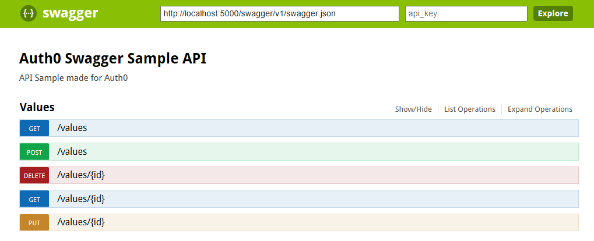

# Auth0 enabled Web App and API with Swagger

This repository consists of two Web applications, both using [Auth0](https://auth0.com) to identify users.

The [Web API](./swaggerapi) is built on ASP.NET Core using [Swagger](http://swagger.io) to document its methods and models and provide an easier way to try it with a clear UI.

The [Web App](./swaggerweb) also built on ASP.NET Core is using [Autorest](https://github.com/Azure/autorest) to auto-generate a client based on the Web API Swagger documentation.

Both applications have a configuration file that you will need to fill with your [Auth0 Account details 
](https://manage.auth0.com/).

In the [Web API appsettings.json](./swaggerapi/appsettings.json), you need to fill your Auth0 domain and client id.

    {
      "Auth0": {
        "Domain": "{YOUR_AUTH0_DOMAIN}",
        "ClientId": "{YOUR_AUTH0_CLIENTID}"
      }
    }

> Note: You can use `appsettings.Development.json` and `appsettings.Production.json` to store your configuration data. Make sure to configure `.gitignore` to not include them in your repository though

In the [Web App appsettings.json](./swaggerweb/appsettings.json), you need to fill some extra values plus the CallbackUrl, which should be equal to your Web App running domain.

    {
     "Auth0": {
        "Domain": "{YOUR_AUTH0_DOMAIN}",
        "ClientId": "{YOUR_AUTH0_CLIENTID}",
        "ClientSecret": "{YOUR_AUTH0_CLIENTSECRET}",
        "CallbackUrl": "http://localhost:5001/signin-auth0"
      } 
    }

## Full Article
The article describing this repository and step-by-step guide can be found at [Auth0's blog](https://auth0.com/blog/aspnet-core-apis-with-swagger-and-autorest/).
